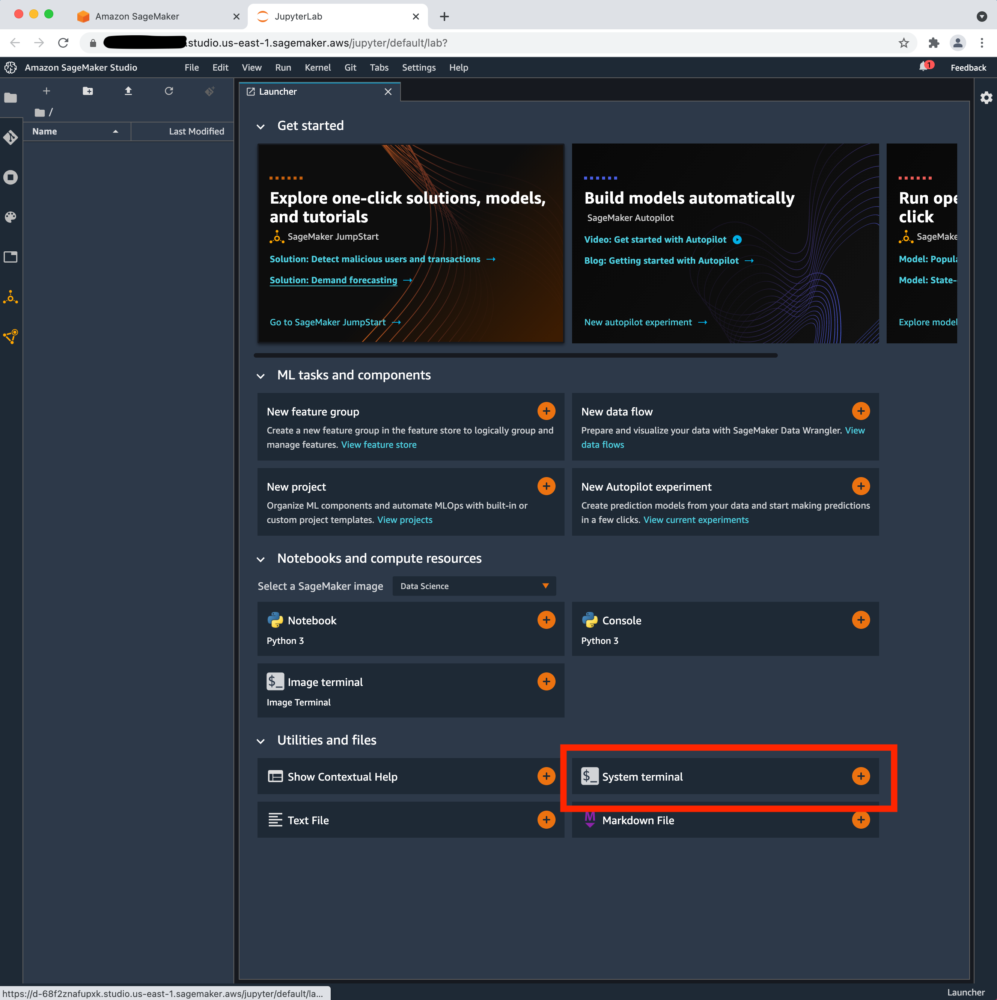
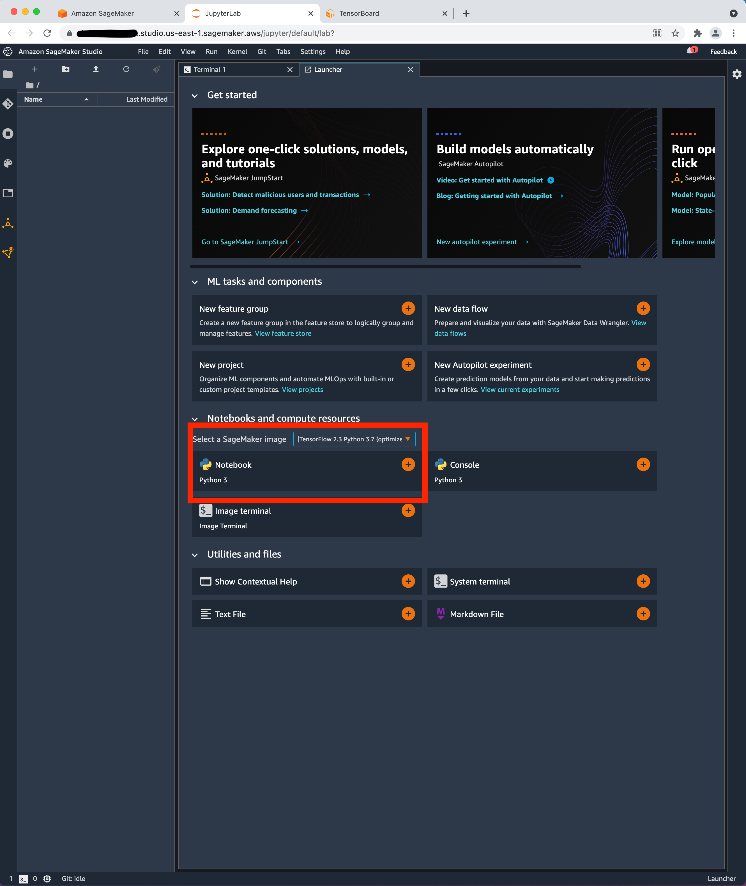

# Steps

- **From SageMaker Launcher, launch the sytem terminal**

- **Install and run tensorboard**

- **Select SageMaker Image**

- **Launch Notebook and run** (check [sample](tensorboard_sample.ipynb) notebook)

  

- **View Tensorboard**

