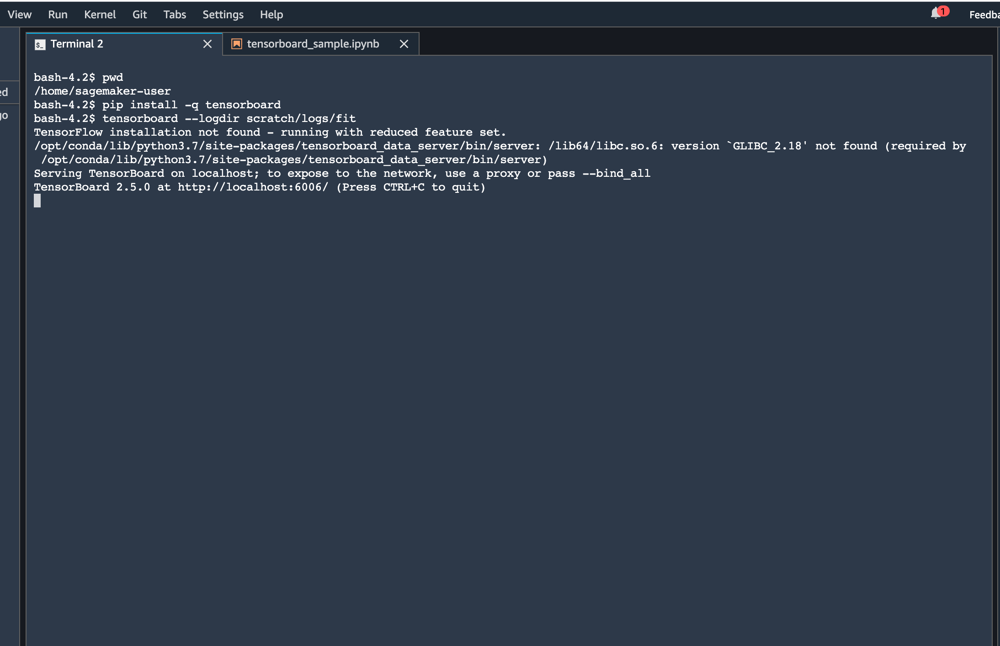
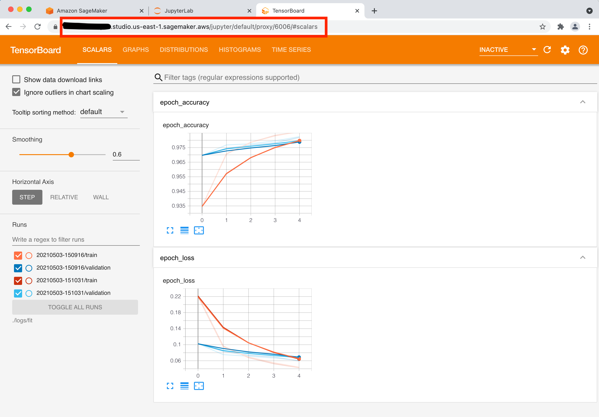

# Launching TensorBoard from SageMaker Studio

## Steps 

- From SageMaker Studio's Jupyter Server, launch the System terminal (under Utilities and files) 


- Run the following commands

  ```pip install tensorboard```

  ```tensorboard --logdir ./logs/fit```
  
  
  
- Select a SageMaker Studio Image


  
- Launch a notebook from launcher and setup TensorboardCallback to `logs/fit` ([sample](tensorboard_sample.ipynb) in this repo uses tensorflow-2.3-cpu-py37)


  
- Copy the studio url and replace **lab?** with **proxy/6006/**

  - Example

    Studio Url - `https://xx.studio.region.sagemaker.aws/jupyter/default/`**lab?**

    After Replace - `https://xx.studio.region.sagemaker.aws/jupyter/default/`**proxy/6006/**


